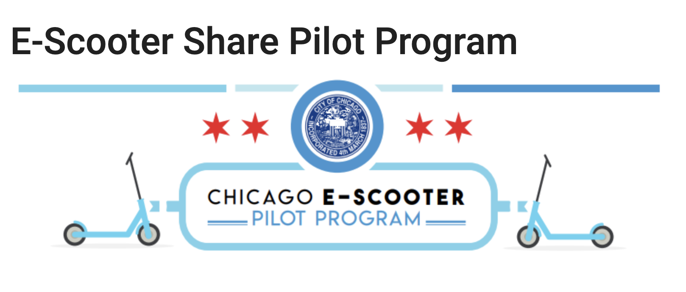

# Base Python Week 1 Code Challenge

The present code challenge will test your skills in base Python.    
You will be asked to show your knowledge of:
 
 - basic Python types - strings, floats/integers, lists, and dictionaries.
 - for-loops and if/else statements
 - functions
 

You are presented with a data set describing scooter rides.  Chicago rolled out a pilot program for rentable scooters in 2019.




```python
# Run cell with no changes

import sys

sys.path.append('src')

%load_ext autoreload
%autoreload 2

from data_import import load_scooter, load_trip_distance, load_start_community_area, load_trip_dictionary
data = load_scooter()
```

    The autoreload extension is already loaded. To reload it, use:
      %reload_ext autoreload


```python
data[0]
```


    {'trip_id': '33b50938-5626-4124-ba57-cc0a3dd058aa',
     'trip_distance': '3793',
     'trip_duration': '1152',
     'start_community_area_number': '15',
     'end_community_area_number': '15'}


As you see in the output from the cell above, each ride data point contains information about distance, time, and the start and end locations of the trips. 

# Strings

Each trip in the Scooter data consists of a `'start_community_area_number'` and an `'end_community_area_number'`.  

The start and end community area number are assigned to two variables below: `trip1_scan` and `trip1_ecan` respectively.

## Task 1:
Create a new variable, `trip1_st_end_cn` that combines the start community area and the end community area with an underscore. 


```python
trip1_scan = data[0]['start_community_area_number']
trip1_ecan = data[0]['end_community_area_number']

# Your code here

```

# Ints and Floats

## Task 2:
Two string variables are defined below named `trip1_dist` and `trip1_time`. 


  - First: convert these strings to integers or floats. 
  - Second: the original units are in meters and seconds. Make a new variable, `trip_mph` which represents speed in mph.  
  
> Hint: to convert meters to miles, divide by 1609.


```python
# Your code here
trip1_dist = data[0]['trip_distance']
trip1_time = data[0]['trip_distance']

trip_mpg = None
```

# Basic List Manipulation

## Task 3

The data list is comprised of 943 scooter rides.


```python
print(f'The scooter ride list has {len(data)} elements.')
```

    The scooter ride list has 943 elements.


They are ordered by start_community_area_number.  The last 30 records are rides starting in community area 31.  
Create a new list called `trips_area_31` that consists of only rides that start in area 31.


```python
# Your code here

trips_area_31 = None
```

## Task 4

Below, information associated with a new trip is defined.  Add this trip to the end of the trips_area_31 list.


```python
new_trip = {'trip_id':'1149z0gf-1a10-4828-bdb9-3b7b3a23d011' , 
                'trip_distance':'3110', 
                'trip_duration':'1099', 
                'start_community_area_number':'31', 
                'end_community_area_number':'28'}

```


```python
# Your code here
```

`trips_area_31` should now have 31 rides in it.

# Basic Dictionary Manipulation

Below is a dictionary which contains data related to a second new trip.


```python
new_trip_2 = {'trip_id':'7129z00gf-2z10-4833-oof1-ca7b3a1pe212' , 
                'trip_distance':'4,400', 
                'trip_duration':'2,000', 
                'start_community_area_number':'31', 
                'end_community_area_number':'21'}

```

Notice that the trip distance and trip duration are represented by strings with commas in them.  Such a format can result in errors during data procesing.

## Task 5

Add new_trip_2 to the `trip_areas_31` list, but before doing so, reassign the value of trip distance and trip duration to values without commas: i.e. 4400 and 2000.   
The final types should still be strings.
You do not have to do fancy string manipulation, but you do have to assign values using **key/value** pairs.  
Do not just fix the strings in the code block above. 


```python
# Your code here for fixing distance and duration
```


```python
# Your code here for adding new_trip_2 to the trips_area_31 list.
```

# For-Loops and if/else statements

The `trip_distance` variable below is **list** of all of the rides' trip distances in their original unit (meters) and type (string).  


```python
trip_distances = load_trip_distance()
```

The distances correspond to the same data in the list of dictionaries above, but the trip distances have been isolated from the other data.

## Task 6

Using a **for-loop** and **if/else** statements, create a new list called `short_rides` which holds all rides less than or equal to 1 mile.   
To do so, you will once again have to convert to miles by dividing by 1609.


```python
# Your code here
short_rides = None
```

## Task 7

What percentage of the total rides are less than or equal to 1 mile?


```python
# Your code here
```

# Processing Two Lists at Once

The variable `start_community_areas` holds a list of community area numbers where each trip started.   


```python
start_community_areas = load_start_community_area()
```

The `start_community_areas` list and the `trip_distance` list are the same length, and are both ordered in the same way.  
In other words, the 1st element of `start_community_areas` and the 1st element of `trip_distance` refer to the same trip.  


```python
len(start_community_areas) == len(trip_distances)
```


    True


The built in [zip](https://docs.python.org/3/library/functions.html#zip) function allows you to iterate through multiple iterables at the same time.  
Each trip through the for-loop processes elements with matching indices from the iterables passed as arguments.

## Task 8

Using a **for-loop** and the **zip** function, create a list called `short_rides_22` which stores all trip_distances (in miles) less than or equal to 1 mile which originated in community area 22.


```python
# Your code here

short_rides_22 = None
```

## Task 9

Next, create a similar for loop, but this time create two lists simultaneously:
 -  the list `short_rides_24` stores all trip_distances (in miles) less than or equal to 1 mile which originated in community area 24.
 -  the list `short_rides_28` stores all trip_distances (in miles) less than or equal to 1 mile which originated in community area 28.


```python
short_rides_24 = None
short_rides_28 = None
```

# Nested Dictionaries

You are now presented with the rides data in a slightly different form. Instead of a list of rides, it is a dictionary.

Each element in the `trips_dictionary` variable below uses the trip_id as a dictionary key, and stores the trip data associated with each key as a second dictionary.

This nested, second dictionary has keys representing all the data you have come to know: trip_distance, trip_duration, start_community_area_number, and end_community_area_number.


```python
trips_dictionary = load_trip_dictionary()

# The trip_id of the 1st ride is used as a key below to output the 1st trip's data
print(trips_dictionary['33b50938-5626-4124-ba57-cc0a3dd058aa'])
```

    {'trip_distance': '3793', 'trip_duration': '1152', 'start_community_area_number': '15', 'end_community_area_number': '15'}


## Task 10

Now, loop through this new dictionary and find all rides **over 20 minutes**. 

Store these rides in a dictionary called `long_rides` with trip_id's as keys and ride time in minutes as the value.

Again, you will have to convert the ride durations to integers, as well as convert seconds to minutes.


```python
# Your code here
# The keys of long_rides will be trip_ids, and the values will be trip_duration in minutes
long_rides = {}
```

# Functions 

## Task 11

Next, create a function called `start_area_durations`, which takes two parameters:

    `start_area`: a string representing the community number of a trip's start community area number.

and either:

    `data`: the full **list** of rides imported above.
    or
    `trips_dictionary`: the dictionary of rides which uses ride_id as keys.
    
The function should loop through the rides and select only those which start in the community area fed to it as an argument.

It should **return** a list of rides, each of which is the full dictionary describing the data of the ride.

> **Note** Whether you use the data variable or the trips_dictionary variable, you should get almost identical output.  
However, using the trips_dictionary may return a list of rides which do not have ride ids.  That is acceptible. Everything else will be the same.


```python
# Your code here

def start_area_durations(start_area, data):
    pass
```


```python

start_area_durations_with_dict('25', trips_dictionary)
```


    [{'trip_distance': '2317',
      'trip_duration': '806',
      'start_community_area_number': '25',
      'end_community_area_number': '19'},
     {'trip_distance': '1704',
      'trip_duration': '2039',
      'start_community_area_number': '25',
      'end_community_area_number': '25'},
     {'trip_distance': '0',
      'trip_duration': '7',
      'start_community_area_number': '25',
      'end_community_area_number': '25'},
     {'trip_distance': '0',
      'trip_duration': '7',
      'start_community_area_number': '25',
      'end_community_area_number': '25'},
     {'trip_distance': '1647',
      'trip_duration': '2362',
      'start_community_area_number': '25',
      'end_community_area_number': '25'},
     {'trip_distance': '6601',
      'trip_duration': '2768',
      'start_community_area_number': '25',
      'end_community_area_number': '25'},
     {'trip_distance': '3677',
      'trip_duration': '2604',
      'start_community_area_number': '25',
      'end_community_area_number': '25'},
     {'trip_distance': '6803',
      'trip_duration': '2189',
      'start_community_area_number': '25',
      'end_community_area_number': '25'},
     {'trip_distance': '11539',
      'trip_duration': '8367',
      'start_community_area_number': '25',
      'end_community_area_number': '25'},
     {'trip_distance': '4000',
      'trip_duration': '1402',
      'start_community_area_number': '25',
      'end_community_area_number': '25'},
     {'trip_distance': '5720',
      'trip_duration': '2411',
      'start_community_area_number': '25',
      'end_community_area_number': '29'},
     {'trip_distance': '5221',
      'trip_duration': '1349',
      'start_community_area_number': '25',
      'end_community_area_number': '19'},
     {'trip_distance': '451',
      'trip_duration': '146',
      'start_community_area_number': '25',
      'end_community_area_number': '25'},
     {'trip_distance': '1284',
      'trip_duration': '903',
      'start_community_area_number': '25',
      'end_community_area_number': '25'},
     {'trip_distance': '1477',
      'trip_duration': '667',
      'start_community_area_number': '25',
      'end_community_area_number': '25'},
     {'trip_distance': '2421',
      'trip_duration': '577',
      'start_community_area_number': '25',
      'end_community_area_number': '25'},
     {'trip_distance': '1249',
      'trip_duration': '539',
      'start_community_area_number': '25',
      'end_community_area_number': '25'},
     {'trip_distance': '2212',
      'trip_duration': '906',
      'start_community_area_number': '25',
      'end_community_area_number': '25'},
     {'trip_distance': '1055',
      'trip_duration': '281',
      'start_community_area_number': '25',
      'end_community_area_number': '25'},
     {'trip_distance': '6626',
      'trip_duration': '6657',
      'start_community_area_number': '25',
      'end_community_area_number': '25'},
     {'trip_distance': '8966',
      'trip_duration': '7784',
      'start_community_area_number': '25',
      'end_community_area_number': '25'}]


```python
start_area_durations('25', data)
```


    [{'trip_id': '8bbe5aea-42c6-5734-80b0-9d9c97db39e7',
      'trip_distance': '2317',
      'trip_duration': '806',
      'start_community_area_number': '25',
      'end_community_area_number': '19'},
     {'trip_id': '6e951d9a-523c-490f-bdf0-9e82f6c746d4',
      'trip_distance': '1704',
      'trip_duration': '2039',
      'start_community_area_number': '25',
      'end_community_area_number': '25'},
     {'trip_id': '4ebe5caf-0663-4c9a-b3bd-ae830abc24fa',
      'trip_distance': '0',
      'trip_duration': '7',
      'start_community_area_number': '25',
      'end_community_area_number': '25'},
     {'trip_id': '2ee54dc7-c08c-4b9e-b99d-c459290abbb9',
      'trip_distance': '0',
      'trip_duration': '7',
      'start_community_area_number': '25',
      'end_community_area_number': '25'},
     {'trip_id': '0b398fd4-d0ec-4536-b51f-e24cfdba1f97',
      'trip_distance': '1647',
      'trip_duration': '2362',
      'start_community_area_number': '25',
      'end_community_area_number': '25'},
     {'trip_id': '3b008a89-52a5-4984-b9ed-3565dfbb4abb',
      'trip_distance': '6601',
      'trip_duration': '2768',
      'start_community_area_number': '25',
      'end_community_area_number': '25'},
     {'trip_id': '198b4a86-2e88-450a-b387-4a76ee42e787',
      'trip_distance': '3677',
      'trip_duration': '2604',
      'start_community_area_number': '25',
      'end_community_area_number': '25'},
     {'trip_id': '8c3f418b-4f4c-4d05-b3a2-4159afe71e20',
      'trip_distance': '6803',
      'trip_duration': '2189',
      'start_community_area_number': '25',
      'end_community_area_number': '25'},
     {'trip_id': '11c7c441-ef74-4944-11c7-c441ef744944',
      'trip_distance': '11539',
      'trip_duration': '8367',
      'start_community_area_number': '25',
      'end_community_area_number': '25'},
     {'trip_id': '1fc09511-0552-4143-b62b-3359e71e485c',
      'trip_distance': '4000',
      'trip_duration': '1402',
      'start_community_area_number': '25',
      'end_community_area_number': '25'},
     {'trip_id': '2ad94a4e-e487-4d96-b19c-0f0e8b205b80',
      'trip_distance': '5720',
      'trip_duration': '2411',
      'start_community_area_number': '25',
      'end_community_area_number': '29'},
     {'trip_id': '3b598026-c15a-41a4-bd8c-b1de9e275b19',
      'trip_distance': '5221',
      'trip_duration': '1349',
      'start_community_area_number': '25',
      'end_community_area_number': '19'},
     {'trip_id': '799a7e01-6732-4b06-b862-4b943f2db45f',
      'trip_distance': '451',
      'trip_duration': '146',
      'start_community_area_number': '25',
      'end_community_area_number': '25'},
     {'trip_id': '879c8b76-c778-424c-b2cd-61a6a338ab61',
      'trip_distance': '1284',
      'trip_duration': '903',
      'start_community_area_number': '25',
      'end_community_area_number': '25'},
     {'trip_id': '6c7afdcf-28f1-4dde-ba0d-b85c6eb4451c',
      'trip_distance': '1477',
      'trip_duration': '667',
      'start_community_area_number': '25',
      'end_community_area_number': '25'},
     {'trip_id': '63f95a46-3b5a-498e-bb50-28e0844089e7',
      'trip_distance': '2421',
      'trip_duration': '577',
      'start_community_area_number': '25',
      'end_community_area_number': '25'},
     {'trip_id': '179e4670-0c51-4333-b99e-9d28b6dd6297',
      'trip_distance': '1249',
      'trip_duration': '539',
      'start_community_area_number': '25',
      'end_community_area_number': '25'},
     {'trip_id': '4ce890d4-0df3-40d1-bce5-d91acc55daff',
      'trip_distance': '2212',
      'trip_duration': '906',
      'start_community_area_number': '25',
      'end_community_area_number': '25'},
     {'trip_id': '0bf87fbd-c799-4381-b839-583d1a6c2566',
      'trip_distance': '1055',
      'trip_duration': '281',
      'start_community_area_number': '25',
      'end_community_area_number': '25'},
     {'trip_id': '88e09622-2366-48a6-b2be-cd0fa006a868',
      'trip_distance': '6626',
      'trip_duration': '6657',
      'start_community_area_number': '25',
      'end_community_area_number': '25'},
     {'trip_id': '4b2c012e-2497-4ed5-b784-f62f592ff6f8',
      'trip_distance': '8966',
      'trip_duration': '7784',
      'start_community_area_number': '25',
      'end_community_area_number': '25'}]


## Task 12

Finally, build a second function `start_area_longest_ride` which **returns the distance in miles** of the longest ride for a given start area community number.  
Ideally, this function will act on  the output of the function coded above.

Whether you used the data list or trips_dictionary, the output should be the same.


```python
# Your code here
```


```python
start_area_longest_ride(start_area_durations('25', data))
```


    7.171535114978247


```python
start_area_longest_ride(start_area_durations_with_dict('25', trips_dictionary))
```


    7.171535114978247


```python

```
